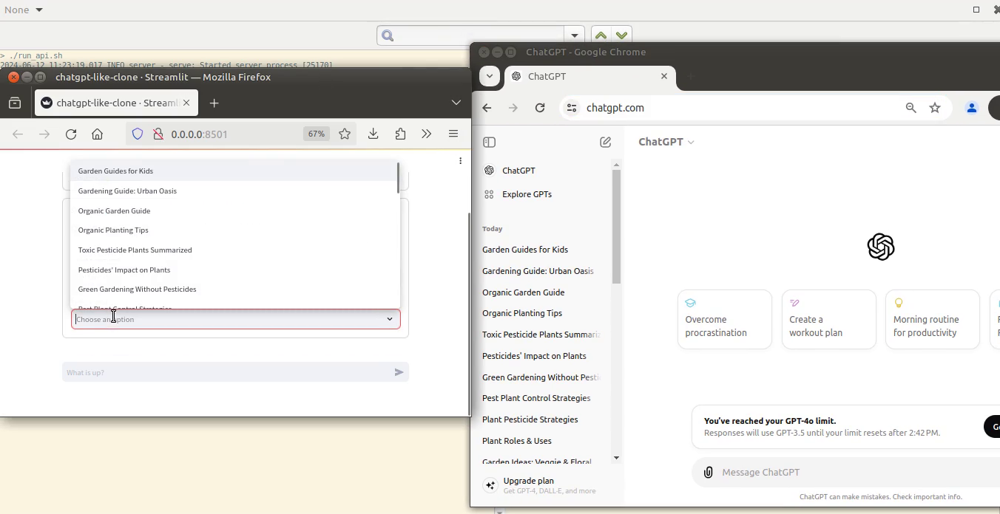

# yoquGPT / w2uGPT / iwuGPT: Hacking ChatGPT, or just an use case to play for a while 

## What does yoqu, w2u, iwu mean?: 

- **yoqu :** yo quiero usar
- **w2u :** want to use 
- **iwu :** I want to use

_A wish, an attempt to use some technologies, a technical challenge, an excuse to learn about something, whatever you want, ¯\_(ツ)_/¯_


## What do you have in this repository?

First the idea: 

I want to use _a resource_ like ChatGPT or something similar to satisfy an use case (e.g.: an application using some LLM model), so I need:
- An API (e.g. FastAPI)
- An application (e.g. streamlit app, Langchain)
- A way to use this resource (e.g. RPA)
- Probably a DB



[Video demo: demo.mp4](images/demo.mp4)

<br>

> **Disclaimer**
> - Note that **this is not the way to use** ChatGPT, or Claude or any _resource_
> - A real application should use the API (e.g. https://platform.openai.com/docs/introduction)
> - ChatGPT responses are not suitables for production use cases

> **After the first version of this development, OpenAI made several changes to the ChatGPT interface (and will probably continue doing so).**

> _I like to say that some RPAs are similar to "sneaking into a party through the back door": you know that you should get an invitation or buy a ticket..._
>
> :-)


This POC/use case involve the following mainly:
- RPA with [Selenium](https://www.selenium.dev/documentation/)
- [FastAPI](https://fastapi.tiangolo.com/)
- [Custom LLM (Langchain)](https://python.langchain.com/docs/modules/model_io/llms/custom_llm)
- [Streamlit](https://docs.streamlit.io/)
- Some bash scripts


## Installation and configuration

1. Install [jq](https://jqlang.github.io/jq/) (bash scripts call it)
2. Install [Chrome Browser](https://www.google.com/chrome/) and [undetected_chromedriver](https://pypi.org/project/undetected-chromedriver/)
3. Install [Python v3.10](https://www.python.org/downloads/) 
4. Create a virtual env (recommended) and activate it
    ```
    python -m venv yoqu
    source yoqu/bin/activate
    pip install --upgrade pip
    ```
5. Clone/download this repository
    ```
    git clone https://github.com/ktxo/yoqu-gpt.git
    cd yoqu-gpt
    ```
6. Install dependencies:
    ```
    pip install -r requirements.txt
    ```
7. Configure [resource configuration file](#resource-configuration-file)

   Modifiy the following: 
   - name
     - desc
     - dump_folder
     - command / options_experimental
     - chromedriver
   - uc_options
   - Copy **undetected_chromedriver** binary to the folder defined in **chromedriver**  
   - Update port or path options if you want: port number (e.g. 9222) and folder user-data-dir) must be unique.

    Each RPA needs a Chrome profile with an already signed-in session and their credentials saved in the profile.
    
    This RPA **doesn't solve any captcha (CloudFare)**, when RPA open the browser go to the url and expect to enter (**don't do any login**, I  hate solving captchas and these kinds of things; they are boring, and I avoid them").  

    Run:

    ```
    ./yoqu_configure.sh  <config_file.json>
    ```
    This script will execute Chrome and open the url, you need to login in, save user, password and then close the browser

    The second time you run the script you should see the chat page instead of login page

8. Configure RPA Manager configuration file [rpa_manager.json](rpa_manager.json) with the list of resource files from previous step

9. Run poc:

    See [images/demo.mp4](images/demo.mp4)
   - Start API executing [run_api.sh](run_api.sh)

     - You should see the browser login to the resource (ChatGPT)
     - Swagger  Yoqu API (http://0.0.0.0:8000/docs)

   Run one of these:
    
   - Streamlit app based on [Build a ChatGPT-like app](https://docs.streamlit.io/knowledge-base/tutorials/build-conversational-apps#build-a-chatgpt-like-app) using Yoqu API
        
        [run_app_st_chatgpt-like-clone-yoqu.sh](run_app_st_chatgpt-like-clone-yoqu.sh) 

    
   - YoquChatGPTLLM Streamlit app with API/Langchain [custom LLM](https://python.langchain.com/docs/modules/model_io/llms/custom_llm#28) using Yoqu API ([YoquChatGPTLLM](ktxo/yoqu/langchain/yoqu_llm.py))   
    
        [run_app_st_langchain_llm.sh](run_app_st_langchain_llm.sh)


## Resource configuration file

Each YoquResource (a RPA) has a configuration file (see [yoqu_rpa_chatgpt1.json](yoqu_rpa_chatgpt1.json) or [yoqu_rpa_claude.json](yoqu_rpa_claude.json)) like: 

```
{
  "desc": "Some description for this resource",
  "type": "chatgpt",      ## Type: chatgpt | claude
  "dump": true,           ## Enable to save data to dump folder 
  "dump_folder": "dump",  ## Dumpt folder
  
                          ## These options are used by each specific resource
  "resource": {
    "debug": false,                     ## Pending to allow dump page/screenshot      
    "url": "https://chat.openai.com",   ## URL for RPA
    "url_login": "https://openai.com",  ## URL to login to the site (used by yoqu_configure.sh)
    "url_title": "ChatGPT",             ## URL title for url resource.url
    
    ## Command to launch te browser, browser is started using : psutil.Popen([resource.command] + [resource.url])  
    "command": [                                
      "/opt/google/chrome/chrome",              ## Path to chrome browser
      "--remote-debugging-port=9222",           ## Debug port for this browser instance, must be unique 
      "--user-data-dir=chrome_data/chatgpt"     ## Path to chrome data 
    ],
    "sleep_range": [1,3],                       ## RPA random delays: time.sleep(random.randint(*sleep_range))
    "options": ["--log-level=3"],               ## Chromedriver options
    "options_experimental": [                   ## Chromedriver experimental options
      ["debuggerAddress", "127.0.0.1:9222"]
    ],
    "uc_options": {                                         ## undetected_chromedriver options
      "headless": false,
      "use_subprocess": true,
      "user_data_dir": "chrome_data/chatgpt2",              ## Path to chrome data
      "driver_executable_path": "./undetected_chromedriver" ## Path to undetected_chromedriver
    }    
  },
  "wait": 10
}
```


## Next steps, improvements, changes, y otras yerbas

- Review all (too dirty)
-  Some improvements:
   - Review error handling and retries in RPA, for example: ChatGPT send errors when there are high traffic in their platform
   - Detect and bypass Cloudflare captcha
   - Headless browser 
   - Automatic configuration of Chrome Profile from configuration file
   - Add "ephemeral" chats: create chat, get response, delete chat (✅)
   - Review response time (since browser receive the response)
- Pending:
   - Add delete chat operation to API
   - Fix scroll all chats (RPAChatGPTResource_select_chat()) 
   - Review Custom LLM: output parsers
   - Process handling
   - Review 
     - restart operation
     - Review stats/status
     - dump
- Add Claude (https://claude.ai/) (I'm testing it)
- Add more resources (e.g. Bard, Perplexity)
- DB design/CRUD
- Remote RPA instances (different machines) 
- Add more use cases: spacy integration, more langchain
- ...

After the latest changes in the ChatGPT interface, I noticed weird errors controlling the page with Selenium. I deleted the Chrome profile to solve it. 

## Final

If you find this useful, interesting, boring, unuseful, funny, waste of time, or whatever feel free to contact me


